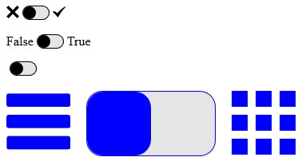
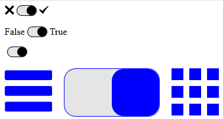
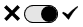
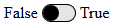

# Input Boolean
WebComponent for creating customisable boolean input elements.

## Preview:



## Attribute:
```true``` : If present value is set to true (i.e. the right value is choosen)

## Named slots:
The left option: ```false-opt```

The right option: ```true-opt```

## Usage:
```HTML
<input-boolean></input-boolean>
```
Results in: 

```HTML
<input-boolean true></input-boolean>
```
Results in: 

```HTML
<input-boolean>
	<span slot="false-opt"></span>
	<span slot="true-opt"></span>
</input-boolean>
```
Results in: 